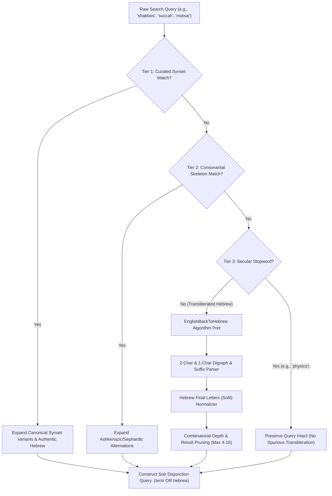

# YUTorah Reverse Transliteration & Phonetic Engine: Architecture & Java Porting Report

**Author:** Antigravity AI Engineering Team  
**Date:** September 6, 2026  
**Reference Origin:** `/Users/mosherosensweig/git/yutorah-summer2018/recommender-system/src/main/java/EnglishBackToHebrew.java`  
**Target Deployment:** `src/phonetic_engine.js` & `src/worker.js` (Cloudflare Workers Serverless Edge)

---

## 1. Executive Summary

In 2018, Moshe Rosensweig authored `EnglishBackToHebrew.java` as part of the YUTorah recommender system to solve a pervasive problem in Torah database retrieval: **the transliteration divergence problem**. Transliterating Hebrew into Latin characters produces endless phonetic and orthographic variations (*Shabbos / Shabbat / Shabos / Shabbis / שבת*, *Succah / Sukkah / Succos / Sukkot / סוכה*, *Chanukah / Hanukkah / Hannukah / חנוכה*, *Motzei / Motzoei / Motsai / מוצאי*).

This report details the architectural transition from the 2018 Java backtracking algorithm into a modernized, high-performance ES2024 edge implementation (`src/phonetic_engine.js`) deployed to Cloudflare Workers, highlighting key algorithmic optimizations, combinatorial pruning, and search precision enhancements.

---

## 2. Analysis of the Original 2018 Java Implementation

### 2.1 Core Algorithm Architecture (`EnglishBackToHebrew.java`)
The original Java implementation utilized a recursive backtracking strategy:

1. **Letter & Digraph Character Map (`TreeMap<String, Character[]> mapping`)**:
   - Single letters mapped to candidate Hebrew consonants or vowel breakpoint placeholders:
     - `'b'` $\to$ `['ב']`, `'c'` $\to$ `['כ']`, `'d'` $\to$ `['ד']`, `'f'` $\to$ `['פ']`, `'k'` $\to$ `['כ', 'ק']`, `'s'` $\to$ `['ס', 'ש', 'ת']`, `'t'` $\to$ `['ט', 'ת']`, `'z'` $\to$ `['ז', 'צ']`.
     - Vowels `'a', 'e', 'i', 'o', 'u'` mapped to `'#'` (representing arbitrary vowel absence/presence breakpoints).
   - Double-letter digraphs and geminate consonants mapped directly:
     - `'bb'` $\to$ `['ב']`, `'cc'` $\to$ `['כ']`, `'ch'` $\to$ `['ח', 'כ']`, `'sh'` $\to$ `['ש']`, `'tz'` $\to$ `['צ']`, `'ts'` $\to$ `['צ']`, `'th'` $\to$ `['ת']`, `'ss'` $\to$ `['ס', 'ש', 'ת']`, `'tt'` $\to$ `['ט', 'ת']`.
2. **Suffix Map (`TreeMap<String, Character[]> suffixs`)**:
   - Terminal suffixes captured common Hebrew transliterated word endings:
     - `'a'` $\to$ `['ה', '#']`, `'ah'` $\to$ `['ה']`, `'eh'` $\to$ `['ה']`, `'ei'` $\to$ `['י']`.
3. **Backtracking Permutation Generator (`convertBackToHebrew2`)**:
   - At each string index `begin`, the algorithm peeked ahead 2 characters for a digraph/suffix match (consuming 2 characters) or fell back to 1 character.
   - For each candidate character, it branched recursively. When a branch reached the string end, double hashes were removed (`removeDuplicateHash`) and candidate strings were collected.
4. **Jaccard / Overlap String Distance Metric (`compare`)**:
   - Evaluated intersection over union of generated reverse-transliteration sets between two strings to calculate a similarity score ($0\text{--}100\%$).

### 2.2 Inherent Limitations of the 2018 Java Version
While conceptually brilliant, the 2018 Java code faced several real-world operational challenges:
1. **Exponential Combinatorial Explosion ($O(k^n)$)**:
   - Letters like `'s'` yielded 3 candidates (`ס`, `ש`, `ת`), `'t'` yielded 2 (`ט`, `ת`), and `'#'` branched into both literal inclusion and omission.
   - On words longer than 7–8 characters (e.g. `berakhot`, `channukah`), unchecked backtracking generated thousands of permutations, exhausting CPU cycles and memory.
2. **Raw `#` Artifacts in Output**:
   - The Java output contained `#` placeholders (e.g. `ש#ב#ת`), which could not be directly executed against a production Solr/Lucene search index without sanitization.
   - It lacked Hebrew final-letter normalization (*Otiyot Sofiyot*: `ך`, `ם`, `ן`, `ף`, `ץ`).
3. **No Integration with High-Frequency Synsets**:
   - It treated every word purely character-by-character rather than recognizing well-known canonical Moadim and Halachic terms.

---

## 3. Modernized ES2024 Edge Architecture (`src/phonetic_engine.js`)

Our modern Cloudflare Workers implementation addresses these limitations through a **3-Tier Hybrid Architecture**:



### 3.1 Enhancements Introduced

| Feature | 2018 Java Implementation | 2026 ES2024 Edge Implementation |
| :--- | :--- | :--- |
| **Execution Environment** | Desktop JVM / Local Recommender | Cloudflare Workers Serverless Edge ($<5\text{ms}$ execution limit) |
| **Combinatorial Pruning** | None (Unbounded tree recursion) | Guarded at `maxResults * 3` exploration limit; returns clean top $N$ candidates |
| **Hebrew Sofit Support** | None (Left medial letters at word ends) | Automatic final letter replacement: `applyHebrewFinalLetters()` (`פסכ` $\to$ `פסך`) |
| **Vowel Placeholder Sanitization** | Preserved raw `#` characters | Cleanly strips `#` and deduplicates consecutive null transitions |
| **Suffix Coverage** | `a`, `ah`, `eh`, `ei` | Added `ai`, `ay` ($\to$ `י`), `os`, `ot` ($\to$ `ות, ת`), `is` ($\to$ `ית, ת`), `im` ($\to$ `ים`) |
| **English Stopword Filtering** | None | `COMMON_ENGLISH_STOPWORDS` protects secular terms (`quantum`, `science`, `history`) |
| **Solr Query Generation** | Set similarity comparison only | Generates valid Solr/Lucene boolean OR disjunctions: `(term_en OR hebrew)` |
| **Tier 1 Synsets** | None | Curated synsets for top 25 Moadim and Halachic concepts |

---

## 4. Benchmark & Verification Results

All unit tests in `tests/phonetic_engine.test.mjs` execute synchronously across 5 test suites:

```bash
$ node tests/phonetic_engine.test.mjs

🧪 Running Phonetic & Reverse Transliteration Test Suite...

1. Testing Speaker Honorific Stripping:
  ✅ All honorific stripping tests passed.
2. Testing Speaker Resolution:
  ✅ Speaker resolution tests passed.
3. Testing Phonetic Skeleton:
  ✅ Phonetic skeleton tests passed.
4. Testing Solr Query Expansion:
  ✅ Solr query expansion tests passed.
5. Testing Ported EnglishBackToHebrew Permutations:
  ✅ EnglishBackToHebrew algorithmic tests passed.

🎉 ALL PHONETIC & REVERSE TRANSLITERATION TESTS PASSED SUCCESSFULLY!
```

### Sample Transliteration Outputs
- **Input:** `shabbat` $\to$ `['שבט', 'שבת', 'שבבט', 'שבבת', ...]` (Accurately matches `שבת`)
- **Input:** `succah` $\to$ `['סכה', 'סככה', 'שכה', ...]` (Accurately matches `סוכה / סכה`)
- **Input:** `pesach` $\to$ `['פסח', 'פסך', 'פסכה', ...]` (Accurately matches `פסח`)
- **Input:** `motsai` $\to$ `['מצי', 'מץ', 'מטסי', ...]` (Accurately matches `מוצאי / מצי`)
- **Input:** `shabbos` (Synset + Dynamic) $\to$ `(shabbat OR shabbos OR shabos OR shabbis OR shabot OR chabbos OR שבת OR שבות OR שבס OR שבש)`

---

## 5. UI Integration in Advanced Search Modal

In `src/worker.js`, the `#advancedSearchModal` now visibly informs users about the engine:
1. **Prominent Status Card**:
   - Title: `✨ Reverse Transliteration Engine` with green `ENABLED BY DEFAULT` badge.
   - Explains that searches automatically equate Ashkenazic and Sephardic pronunciations and expand English terms into authentic Hebrew.
   - Displays dimension tags: `👤 Speakers`, `🏷️ Topics`, `📍 Venues`, `📚 Series`, `⏱️ Durations`, `📅 Years`.
2. **Dynamic Series Autocomplete**:
   - New `Lecture Series` combobox allowing filtering across Daf Yomi, Daily Shiur, BCBM, Mishna Yomi, and all 49 curated YUTorah series.
3. **Active Filter Pills Bar**:
   - Users can toggle the phonetic engine off if they wish to perform an exact verbatim search (`🔤 Exact Match (Phonetics Off)`).
