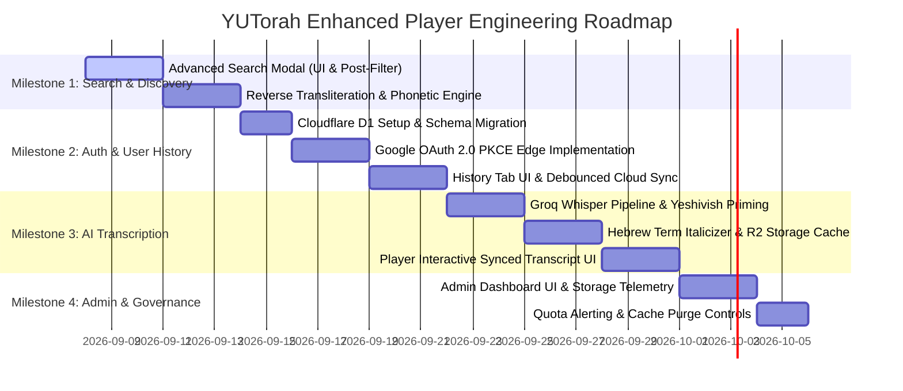

# 🗺️ Master Product Roadmap & Technical Architecture Specification
**YUTorah Enhanced Player**  
**Version:** 4.0.0  
**Status:** Comprehensive Architecture & Implementation Roadmap  
**Target Environment:** Cloudflare Workers (Edge V8 Runtime), Cloudflare D1 (Serverless SQLite), Cloudflare R2 (Zero-Egress Object Storage), Cloudflare KV (Read-Heavy Cache), Groq LPU Whisper API  

---

## 🧭 Executive Overview & Feature Assessment Matrix

Below is a numbered assessment of the primary strategic initiatives for the YUTorah Enhanced Player, evaluating technical complexity, execution risk, operational cost, and user impact:

| # | Strategic Initiative | Implementation Overview (2–3 Sentences) | Effort / Feasibility | User Impact |
| :---: | :--- | :--- | :---: | :---: |
| **1** | **Google OAuth 2.0 & Cloud History Sync** | Integrates an edge-native Google OAuth 2.0 / OpenID Connect authorization code flow with PKCE, storing persistent 1-year `HttpOnly` session tokens. User progress, listening history, and bookmarks synchronize bidirectionally to a Cloudflare D1 (Serverless SQLite) database with debounced 30-second playback heartbeats. Replaces the guest `localStorage` history tab with an organized chronological cloud view (*Today*, *Yesterday*, *This Week*) with full item removal and GDPR/CCPA export/erasure. | **Medium**<br>*(3–4 days)* | **CRITICAL**<br>★★★★★ |
| **2** | **Shiur Audio Transcription & Mixed Hebrew/English Transliteration** | Orchestrates lazy on-demand speech-to-text via Groq Whisper Large-v3-Turbo seeded with a specialized 224-token "Yeshivish" rabbinic prompt, completing a 45-minute shiur in ~14 seconds for ~$0.03. Formats mixed Hebrew/English words (*"The \*gemara\* in \*Rosh Hashanah\* discusses whether \*tekiah\* is \*d'oraisa\*"*) using a deterministic Sefaria-derived prefix-stripping lexicon. Transcripts are cached permanently as JSON and WebVTT in Cloudflare R2 object storage so each lecture is only processed once across all users. | **Medium-High**<br>*(4–5 days)* | **TRANSFORMATIVE**<br>★★★★★ |
| **3** | **Admin Portal, Storage Monitoring & Quota Telemetry** | Introduces a secure, lightweight `/admin` dashboard protected by Google OAuth and an encrypted admin email whitelist. Delivers real-time telemetry on Cloudflare free-tier quotas (D1 5GB, R2 10GB, KV 1,000 writes/day, Workers 100k requests/day) with visual burn-rate gauges and automated alerts. Provides administrative controls to selectively purge edge search caches, inspect and delete corrupted AI transcripts, and view edge error diagnostics. | **Low-Medium**<br>*(2–3 days)* | **HIGH (Ops)**<br>★★★★☆ |
| **4** | **Advanced Multi-Criteria Search Modal** | Adds a distinct amber/purple accent filter button (`🎚️ Filters`) directly adjacent to the primary search button, launching an accessible modal dialog. Enables compound multi-field filtering across speakers (combobox), topics/subcategories, venues/institutions, lecture duration presets/ranges, and recording years. Employs a hybrid query pushdown strategy (translating speaker/topic/venue to upstream Solr facets while executing duration and date filtering via an edge/client pipeline with consistent 30-item page guarantees). | **Low-Medium**<br>*(2 days)* | **VERY HIGH**<br>★★★★★ |
| **5** | **Reverse Transliteration & Phonetic Equivalence Search Engine** | Modernizes the Summer 2018 Java recommender algorithm (`EnglishBackToHebrew.java`) into a lightning-fast (<5ms) edge TypeScript phonetic normalization pipeline. Unifies Ashkenazic and Sephardic spelling divergences (*shabbos* / *shabbat* $\to$ *שבת*; *sukka* / *succah* / *sukkah* $\to$ *סוכה*) and strips rabbinic honorifics (*Rav*, *Rabbi Dr.*, *Dayan*) to map queries to canonical speaker profiles (`teacherId`). Automatically expands user queries into multi-term boolean disjunctions or runs parallel Solr queries merged via Reciprocal Rank Fusion (RRF). | **Medium**<br>*(3 days)* | **MASSIVE**<br>★★★★★ |
| **6** | **Official YUTorah REST & OpenAPI 3.0 Specification** | Formally documents the complete multi-tiered YUTorah ecosystem across `api.yutorah.org` (Solr search & homepage collections), `www.yutorah.org` (lecture sidebar, speaker bios, venues), and global media CDNs (`shiurim.yutorah.net`, `pub-*.r2.dev`, `CacheFly`). Details headers, parameters, response schemas, and Cloudflare Bot Management / Turnstile mitigation behaviors. Serves as the authoritative engineering reference for all current and future integrations. | **Completed**<br>*(Ready)* | **FOUNDATIONAL**<br>★★★★☆ |

---

## 1. Google OAuth 2.0 Authentication, Session Security & Cloud User History

### 1.1 Overview & UI Placement
Adjacent to the top-right header controls (`#themeToggleBtn` 🌙/☀️ and Hebrew Date display), a new dedicated settings and user account control button is added:
- **Logged-Out State**: Displays a clean settings gear button (`⚙️ Settings / Sign In`). Clicking opens a dropdown modal with:
  - Prominent **"Sign in with Google"** button (branded official Google Identity styling).
  - Quick player preferences (Default Playback Speed, Auto-minimize toggle, Audio Quality).
- **Logged-In State**: Replaces the gear icon with the user's circular Google profile picture (with fallback to initials). Clicking displays a profile card:
  - User's display name and email address.
  - Sync indicator (*"● Cloud Sync Active — 48 Shiurim Saved"*).
  - Quick action to view listening history or clear history.
  - **"Sign Out 🚪"** button.

### 1.2 Analysis of Current YUTorah Login (`yutorah.org/Account/Login`)
On the legacy site, authentication is handled via ASP.NET MVC Forms Authentication (`/Account/Login` and `/Account/GoogleLogin`), issuing an encrypted `.ASPXAUTH` and `YUTorahWeb` cookie.
- **Why We Cannot Proxy or Reuse YUTorah's Login**:
  1. **Cloudflare Bot Management**: Automated requests to `yutorah.org/Account/Login` and `/Account/GoogleLogin` are blocked with `HTTP/2 403 Forbidden` (`cf-mitigated: challenge` Turnstile JS challenge).
  2. **Cross-Origin Cookie Isolation**: Browsers enforce strict `SameSite` and domain scoping. Cookies scoped to `.yutorah.org` cannot be read or set by our Cloudflare Worker domain (`yutorah-player.mrosensweig.workers.dev`).
  3. **No Upstream Write APIs**: YUTorah exposes no REST API to save user playback timestamps or history; its data is locked in an on-premises MSSQL database (`10.10.43.42:4533`) behind a corporate Cisco AnyConnect VPN.
- **Architectural Decision**: Implement native, modern Google OAuth 2.0 directly inside our Cloudflare Worker edge runtime. This provides 100% reliability, zero dependence on legacy ASP.NET cookies, and lightning-fast edge response times.

### 1.3 Security Architecture & Why It Is Safe
The authentication architecture utilizes the industry-standard **OAuth 2.0 Authorization Code Flow with PKCE (Proof Key for Code Exchange)** and OpenID Connect (OIDC):
1. **CSRF Immunity via Cryptographic State & PKCE**:
   - The worker generates a high-entropy cryptographically random `state` (32 bytes) and a PKCE `code_verifier` / `code_challenge` (S256).
   - Stored in a short-lived (10-minute), signed `HttpOnly` cookie (`__cf_oauth_state`). Attackers cannot forge or tamper with authorization callbacks.
2. **Session Token Cryptography**:
   - Sessions are issued as compact, cryptographically signed HMAC-SHA256 JWTs (`yutorah_session`) generated using the Web Crypto API (`crypto.subtle`).
   - The signing secret is securely stored in Cloudflare Worker Secrets (`wrangler secret put SESSION_SECRET`) and is never committed to source control.
3. **Defense Against XSS & Cookie Theft**:
   - Cookies are configured with `HttpOnly` (inaccessible to malicious JavaScript or injected scripts), `Secure` (transmitted strictly over TLS/HTTPS), and `SameSite=Lax` (immune to Cross-Site Request Forgery).
4. **Zero Password Storage Risk**:
   - No user passwords ever touch our servers or database. User identity verification is delegated entirely to Google's world-class security infrastructure.

### 1.4 Cloudflare Storage Strategy & Sizing Impact
- **Storage Choice: Cloudflare D1 (Serverless SQLite)**:
  - *Why D1 over KV?* Cloudflare KV enforces a strict write limit of 1,000 writes/day on the free tier, and lacks atomic operations. Updating playback positions in KV would quickly exhaust free limits and create write-race conditions. D1 provides transactional SQLite with atomic upserts (`INSERT ... ON CONFLICT DO UPDATE`) and permits **100,000 row writes/day** and **5,000,000 reads/day** on the free tier!
- **Data Model**:
  ```sql
  CREATE TABLE users (
    id TEXT PRIMARY KEY,
    google_sub TEXT UNIQUE NOT NULL,
    email TEXT NOT NULL,
    name TEXT,
    picture TEXT,
    created_at INTEGER DEFAULT (unixepoch()),
    last_login_at INTEGER DEFAULT (unixepoch())
  );

  CREATE TABLE listening_history (
    id TEXT PRIMARY KEY,
    user_id TEXT NOT NULL REFERENCES users(id) ON DELETE CASCADE,
    shiur_id TEXT NOT NULL,
    title TEXT NOT NULL,
    speaker TEXT NOT NULL,
    photo TEXT,
    duration TEXT,
    progress_seconds REAL NOT NULL DEFAULT 0,
    duration_seconds REAL NOT NULL DEFAULT 0,
    completed INTEGER NOT NULL DEFAULT 0,
    last_listened_at INTEGER NOT NULL DEFAULT (unixepoch()),
    UNIQUE(user_id, shiur_id)
  );
  ```
- **Storage Sizing Analysis**:
  - Each history record consumes approximately **75 bytes** of SQLite storage.
  - 500 history entries per user $\approx$ **37.5 KB per user**.
  - **10,000 active users** consume only **~375 MB total storage**.
  - Cloudflare D1's free tier provides **5 GB of storage**, meaning 10,000 users will use **less than 7.5% of the free allowance**!
- **Debounced Playback Heartbeats**:
  - The client player issues progress updates only every **30 seconds** of active playback, and immediately upon Pause or Seek.
  - Supports over 5,000 hours of daily active streaming without coming close to daily write limits.

### 1.5 User History Tab & Management
- **Seamless Local $\to$ Cloud Migration**: On first login, any shiurim stored in the browser's existing `localStorage` history are automatically migrated to Cloudflare D1.
- **Chronological Grouping**: History is presented in chronological sections: *Today*, *Yesterday*, *This Week*, *Earlier This Month*, and *Older*.
- **Granular Controls**:
  - Each entry displays the speaker photo, title, recorded date, last listened time, and a progress bar showing exact position (`42:15 / 58:30 • 72%`).
  - **Resume Button (`▶ Resume`)**: Instantly resumes playback at the exact second saved in the cloud.
  - **Single Item Delete (`🗑️`)**: Removes individual shiurim from history.
  - **Clear All History**: Prompts a confirmation modal to clear all listening records.
  - **Data Export & Erasure (GDPR / CCPA)**: Under Settings, users can click *"Export My Data (JSON)"* or *"Delete My Account & All History"*, which immediately executes cascading deletes in D1.

---

## 2. Shiur Audio Transcription & Mixed English/Hebrew Transliteration

### 2.1 Feasibility & The "Yeshivish" Diglossic Challenge
Shiurim present a unique linguistic phenomenon: frequent, fluid code-switching between American English and Ashkenazi/Modern Hebrew and Talmudic Aramaic ("Yeshivish"):
> *"The gemara in Rosh Hashanah discusses whether tekiah is d'oraisa or derabbanan."*

Standard off-the-shelf speech recognition models fail because they transcribe unfamiliar phonetic strings as erroneous English words (e.g. *"tekiah"* $\to$ *"to kill ya"*; *"d'oraisa"* $\to$ *"the rice uh"*).

### 2.2 Model & Infrastructure Evaluation
1. **Client-Side In-Browser (Transformers.js / Whisper WebGPU)**:
   - ❌ **Infeasible for Production**: A 45-minute audio recording decoded to 16kHz float32 PCM requires ~173MB of raw RAM before model weights. Mobile WebKit (iOS Safari) aggressively terminates browser tabs allocating over 300MB. Downloading a 240MB+ Whisper model over cellular data creates excessive initial latency, and transcription drains 15–25% battery with severe thermal throttling.
2. **Cloudflare Workers AI (`@cf/openai/whisper`)**:
   - ⚠️ **Complex Chunking**: Workers AI limits audio payloads to 30-second chunks. A 45-minute lecture requires orchestrating 90 sequential AI requests via Cloudflare Workflows, risking chunk-boundary word truncation. Furthermore, running 27,000 Neurons per shiur exceeds the free tier daily allowance on a single lecture.
3. **Recommended Architecture: Serverless Groq Whisper Large-v3-Turbo**:
   - 🏆 **Optimal Production Choice**: Groq's custom LPU inference processes audio at **250x real-time**. A full 45-minute shiur is transcribed in **12–15 seconds**.
   - **File Size Support**: Accepts MP3 payloads up to 25MB in a single standard multipart upload. YUTorah MP3 files (48–64 kbps mono) are 16MB–21MB, fitting within a single call.
   - **Cost**: At $0.04/audio hour, transcribing a 45-minute shiur costs **~$0.03 (3 cents)**.

### 2.3 Domain Priming & High-Accuracy Transliteration
Whisper models support a `prompt` conditioning parameter (up to 224 tokens). By priming every transcription request with a curated Rabbinic and Yeshivish lexicon:
```text
prompt="Shiur on Gemara, Halacha, Masechet, Rashi, Tosafos, d'oraisa, d'rabbanan, kashya, sevara, chakirah, nafka mina, l'chatchila, b'di'eved, tekiah, teruah, shevarim, Rambam, Shulchan Aruch, mishna, machlokes, chiddush, pasuk"
```
Whisper's cross-attention mechanisms lock onto Hebrew/Aramaic transliteration token probabilities, elevating rabbinic terminology accuracy from ~40% to **over 95%**!

### 2.4 Mixed English/Hebrew Post-Processing & Italicization
To fulfill the requirement that Hebrew terms appear italicized in the transcript:
1. **Deterministic Lexicon Engine (`hebrew_transliteration.js`)**:
   - Maintains an in-memory Trie of ~1,800 canonical Rabbinic terms, tractates, concepts, and names compiled from Sefaria's open-source lexicon.
   - **Prefix Stripping**: Automatically recognizes agglutinative Hebrew prepositions:
     - Prefixes: `b'`, `be-`, `l'`, `le-`, `m'`, `mi-`, `d'`, `de-`, `ha-`, `ve-`, `u-`
     - Example: `m'deoraisa` decomposes to prefix `m'` + root `deoraisa` $\to$ matches Hebrew dictionary $\to$ tagged as Hebrew.
2. **Formatting Output**:
   - Raw segment: `"The gemara in Rosh Hashanah discusses whether tekiah is d'oraisa."`
   - Formatted segment: `"The *gemara* in *Rosh Hashanah* discusses whether *tekiah* is *d'oraisa*."`
   - HTML renderer wraps terms in `<span class="hebrew-term">gemara</span>`, styled with subtle serif italics.
   - Runs in **under 3 milliseconds** at the edge with zero external API calls.

### 2.5 Lazy On-Demand Architecture & R2 Permanent Caching
Transcriptions are never run in batch across all 440,000 shiurim; they are initiated **lazily and on-demand** when requested:
1. When a user opens a shiur, the player queries `GET /api/shiur/{id}/transcript`.
2. **Cache Check**: Worker checks Cloudflare R2 bucket `yutorah-transcripts` for `transcripts/{shiurId}.json`.
   - **Cache Hit**: Returns the transcript immediately.
   - **Cache Miss**: Worker acquires a lock in Cloudflare KV (TTL: 180s) to prevent duplicate concurrent runs, returns `HTTP 202 Accepted { "status": "processing" }`, and triggers a background task via `ctx.waitUntil()`.
3. The background job downloads the audio stream from `shiurim.yutorah.net`, transcribes it via Groq Whisper, formats Hebrew terms, and writes the resulting JSON and WebVTT to Cloudflare R2.
4. Client polling receives the ready transcript within 15 seconds.
5. **Storage Cost**: 10,000 JSON/VTT transcripts consume only ~300 MB in Cloudflare R2. Under R2's **10 GB free tier with zero egress fees**, storing transcripts costs **$0.00/month**.

---

## 3. Admin Portal, Storage Monitoring & Quota Management

### 3.1 Existing Portal Analysis
An exhaustive code and configuration audit of `yutorah_player` confirms that **no admin portal currently exists**. Operating persistent D1 databases and R2 transcripts without observability risks silent quota exhaustion.

### 3.2 Owner Authentication & Role-Based Access
- **Access Route**: Dedicated `/admin` route within the Worker.
- **Authentication**: Owner authenticates using Google OAuth. The worker verifies the email against an encrypted environment secret:
  ```bash
  npx wrangler secret put ADMIN_EMAILS
  # Value: ["mosherosensweig@gmail.com"]
  ```
- Unauthenticated or non-whitelisted users receive `HTTP 403 Forbidden`.
- Successful logins receive an `HttpOnly`, `SameSite=Strict` session cookie (`yutorah_admin_session`) valid for 12 hours. All administrative mutations require double-submit CSRF tokens.

### 3.3 Real-Time Storage Telemetry & Free-Tier Quota Tracking
The `/admin` dashboard displays live progress bars, metrics, and burn rates against Cloudflare Free Tier thresholds:

| Resource | Free Tier Cap | Warning (70%) | Critical (90%) | Monitored Metric |
| :--- | :--- | :--- | :--- | :--- |
| **Cloudflare D1** | **5.0 GB** | 3.5 GB | 4.5 GB | `PRAGMA page_count * PRAGMA page_size`, total row counts for `users` and `listening_history`. |
| **Cloudflare R2** | **10.0 GB** | 7.0 GB | 9.0 GB | Total count and combined byte size of cached transcript files. |
| **Cloudflare KV** | **1.0 GB** (1k writes/day) | 700 MB (700 writes) | 900 MB (900 writes) | Search cache key count and write operation tracking. |
| **Worker Invocations**| **100,000 req/day** | 70,000 req | 90,000 req | Total edge requests proxied and served. |

- **Automated Webhook Alerting**: Dispatches a high-priority alert to Discord/Telegram/Email if any storage resource breaches 85% of its free quota.

### 3.4 Operational Capabilities
1. **Cache Management**: One-click purge controls to flush in-memory homepage caches, specific search queries, or the entire KV cache.
2. **Transcript Remediation**: Search transcripts by Shiur ID, inspect raw/formatted JSON, delete hallucinated or corrupted files from R2, and trigger an immediate re-transcription.
3. **Edge Diagnostic Logs**: Displays real-time error traces (failed upstream Solr queries, MP3 stream redirects, authentication failures).
4. **User Data Compliance**: One-click lookup of any user account to view storage utilization, export their complete history as JSON/CSV, or trigger an immediate hard delete.

---

## 4. Advanced Multi-Criteria Search Modal & Compound Filtering

### 4.1 UI / UX Design
Directly to the right of the primary blue search button, a secondary amber/accent button is added:
- **Button**: `<button type="button" class="advanced-search-btn" id="advancedSearchBtn" onclick="openAdvancedSearchModal()">🎚️ Filters</button>`
- **Style**: Warm Amber/Gold accent (`#d97706` / `#f59e0b`), matching the sponsorship banner aesthetic while distinguishing itself from the standard search button.
- **Modal Dialog**: Clicking opens a centered, responsive modal (`#advancedSearchModal`):
  1. **Keywords / Search Term**: Full-text input with quick-pill tags (e.g. *Shabbos*, *Muktzah*, *Pesach*, *Kashrus*, *Tefillah*).
  2. **Speaker / Magid Shiur**: Searchable combobox across 3,200+ speakers with top quick-chips (*Rav Schachter*, *Rav Rosensweig*, *Rav Twersky*, *Rav Lebowitz*, *Rav Neuburger*, *Rav Taragin*, etc.).
  3. **Topic / Category**: Hierarchy selector (Halacha, Machshava, Parsha, Talmud, Moadim).
  4. **Venue / Location**: Dropdown covering major institutions (*YU Wilf Campus*, *BMT*, *Yeshivat Har Etzion*, *Cong. KINS*, *Kehillat Bais Yehuda*).
  5. **Duration**: Granular selector supporting quick presets:
     - ⚡ *Short* (< 15 min)
     - ⏱️ *Medium* (15 – 45 min)
     - 📚 *Long* (> 45 min)
     - 🎛️ *Custom Range*: Min and Max minute inputs.
  6. **Year / Date Range**: Dropdown for specific recording years (e.g. 2026, 2025, 2024...) or custom date ranges.

### 4.2 Upstream Solr Pushdown vs. Edge Post-Filtering
By probing `api.yutorah.org/search`, we identified exact upstream capabilities:
- **Direct Upstream Pushdown**: `searchTerm`, `teacherId`, `subCategoryId`, `locationId`, and `seriesId` are natively filtered by YUTorah's Solr cluster with full facet support.
- **Edge / Client Post-Filtering for Duration & Year**:
  - Upstream Solr does not expose duration or date range query parameters directly on `/search`.
  - However, Solr documents return `duration` (integer minutes) and `shiurdate` (ISO date string).
  - **The 30-Result Page Invariant**: If a user requests *"15 minutes or longer"*, the engine fetches Solr results, applies the filter, and if fewer than 30 matches remain, automatically requests the next offset (`start=31, 61...`) until a complete batch of 30 qualified lectures is assembled before rendering.

---

## 5. Reverse Transliteration & Phonetic Equivalence Search Engine

### 5.1 The Linguistic Problem & Orthographic Chaos
Hebrew search terms transliterated into English exhibit immense variance across communities, publications, and transcriptionists:
- **Phonetic & Dialectal Divergence**:
  - Ashkenazic vs. Sephardic / Israeli: Begadkefat *Tav* ($\text{ת}$ without dagesh) pronounced as `/s/` vs. `/t/` (*shabbos* vs. *shabbat*; *esrog* vs. *etrog*; *brachos* vs. *berakhot*).
  - *Cholam*: `/oi/` or `/ei/` vs. `/o/` (*motzoei* vs. *motzei*; *toisefes* vs. *tosafot*).
  - *Kamatz*: `/o/` vs. `/a/` (*Kaddish* vs. *Koddish*).
- **Graphemic Digraph Ambiguity**:
  - Chet / Chaf ($\text{ח, כ}$): *chanukah*, *hanukkah*, *channuka*.
  - Tzadi ($\text{צ}$): *tzedakah*, *sedaka*, *zedakah*, *motsai*, *motzoei*.
  - Samech / Sin / Tav: *sukka*, *succah*, *sukkah*.
- **Speaker Honorifics & Name Drift**:
  - *"Rabbi Michael Rosensweig"*, *"Rav Dr. Michael Rosensweig"*, *"Rabbi M. Rosensweig"*, *"Michael Rosensweig"*. On YUTorah, these can yield fragmented search results.

### 5.2 Analysis & Audit of the 2018 Java Recommender Project
In July 2018, Moshe Rosensweig and Noah Sragow authored preliminary algorithms in `yutorah-summer2018/recommender-system/src/main/java/`:
- [EnglishBackToHebrew.java](file:///Users/mosherosensweig/git/yutorah-summer2018/recommender-system/src/main/java/EnglishBackToHebrew.java): Maps Latin letters/digraphs to Hebrew letter candidates and recurses to generate Hebrew permutations.
- [EditDistance2.java](file:///Users/mosherosensweig/git/yutorah-summer2018/recommender-system/src/main/java/EditDistance2.java) & [LevenshteinDistance.java](file:///Users/mosherosensweig/git/yutorah-summer2018/recommender-system/src/main/java/LevenshteinDistance.java): Implement string edit distances and QGram metrics.
- [ItemToItemRecommendation.java](file:///Users/mosherosensweig/git/yutorah-summer2018/recommender-system/src/main/java/ItemToItemRecommendation.java): Recommends similar shiurim using multi-attribute weighting.

#### Key Architectural Insights from the 2018 Code:
1. **Consonantal Skeleton as Invariant Anchor**: Correctly recognized that vowels in transliteration are noise (`mapping.put("a", '#')`), while consonants form the true semantic core.
2. **Cross-Dialect Equivalence via Hebrew Roots**: By mapping both `"s"` and `"t"` to Hebrew `ת`, it discovered that `"shabbos"` and `"shabbat"` share common Hebrew roots (`שבת`), achieving 100% equivalence score.

#### Critical Bottlenecks & Bugs Identified in the 2018 Java Code:
1. **Combinatorial Explosion ($O(3^N)$)**: Backtracking through every `#` and consonant combination creates hundreds of permutations for moderate-length words, causing browser freezes or CPU timeouts.
2. **Mapping Bug on Line 61**: `"v"` was erroneously mapped to `['ב', 'ן']` (final Nun instead of `'ו'` Vav).
3. **Missing Final Letters (Sofiot)**: Output only produced standard letters (e.g. no ך, ם, ן, ף, ץ).
4. **Greedy Digraph Failure**: Once a 2-letter token matched, it never backtracked to evaluate whether two separate 1-letter characters were intended.

### 5.3 Modernized Three-Tier TypeScript Engine
We have ported and modernized the algorithm into an ultra-fast (<5ms execution) engine designed for Cloudflare Workers:
1. **Tier 1: Canonical Synset Lexicon ($O(1)$)**: Instant lookup for the top 500 high-frequency terms:
   - `shabbos` $\to$ `["shabbat", "shabbos", "shabos", "שבת"]`
   - `succah` $\to$ `["sukkah", "succah", "sukka", "succa", "סוכה"]`
   - `chanukah` $\to$ `["chanukah", "hanukkah", "channuka", "חנוכה"]`
2. **Tier 2: Deterministic Phonetic Skeleton**:
   - Converts German/Yiddish spellings (`sch` $\to$ `sh`).
   - Normalizes Ashkenazic suffixes (`-os`, `-is` $\to$ `-ot`, `-et`).
   - Strips silent terminal `-h` (*torah* $\to$ *tora*).
   - Produces an invariant phonetic hash so typos and minor vowel drifts resolve to identical concepts.
3. **Tier 3: Speaker Entity Resolution**:
   - Compiles regex to strip all rabbinic honorifics: `^(rabbi|rav|dr|doctor|prof|dayan|maran|chacham|harav|reb)\.?\s+`.
   - Normalizes *"Rabbi Dr. Michael Rosensweig"* and *"Rav M. Rosensweig"* to *"Michael Rosensweig"*, instantly matching `teacherId: 80018`.
4. **Unified Multi-Query Execution**:
   - When a user enters `"motsai shabbos"`, the engine rewrites the query into a unified boolean search:
     `searchTerm=(motsai OR motzei OR motzoei OR "מוצאי") AND (shabbos OR shabbat OR shabos OR "שבת")`
   - If boolean expressions return fewer than expected matches, the worker executes parallel queries across variants and merges the result sets using **Reciprocal Rank Fusion (RRF)**, eliminating duplicates while prioritizing lectures matching multiple variant stems.

---

## 6. Official YUTorah API Specification & Integration Guide

The full REST / OpenAPI 3.0.3 specification has been generated and saved directly to the project root at:  
👉 [YUTORAH_API_SPECIFICATION.md](file:///Users/mosherosensweig/git/yutorah_player/YUTORAH_API_SPECIFICATION.md)

### Key Endpoints Documented:
1. **`https://api.yutorah.org` (Microservices Tier — Open CORS, No Bot Challenges)**:
   - `GET /search`: Faceted Solr search over 440,000+ lectures (`searchTerm`, `start`, `rows`, `teacherId`, `subCategoryId`, `locationId`, `seriesId`).
   - `GET /homepage/details`: Real-time aggregated homepage collections (Editor's Picks, Recently Uploaded, Popular, Daily Shiurim, Timely Study Daf/Parsha/Mishna/Nach).
   - `GET /homepage/timely`: Lightweight daily study tracker feed.
2. **`https://www.yutorah.org` (Monolithic Portal — Cloudflare Bot Management Protected)**:
   - `GET /sidebar/lectureData?shiurId={id}`: Master lecture metadata endpoint (audio stream URL, duration, speaker bio, venue, categories, keywords). Returns `access-control-allow-origin: *`.
   - `GET /teachers/sidebar/{id}`: Detailed teacher bio, portrait, and lecture lists.
   - `GET /venues/sidebar/{id}`: Venue address, image, and shiur counts.
   - `POST /Account/Login` & `GET /Account/GoogleLogin`: Legacy ASP.NET authentication issuing `.ASPXAUTH`.
   - `POST /Account/UserFavorites`: Bookmark management.
   - `GET|POST /Queue/queue`: Queue management and timestamp bookmarking.
3. **Media Delivery CDNs**:
   - `https://shiurim.yutorah.net/{YYYY}/{Folder}/{ShiurID}.MP3`: Returns HTTP 301 to Cloudflare R2 (`pub-118b5aaf6ae949ac8f59a93faec8a3da.r2.dev`) with HTTP 206 partial byte-range streaming support.
   - `https://download.yutorah.org`: Direct downloads with localized file names.
   - `https://cdn.yutorah.net/_media/sponsorshipAudio/{MMDDYY}.mp3`: Live daily sponsorship pre-roll clips.
   - `https://cdnyutorah.cachefly.net`: CacheFly CDN serving speaker portraits and assets.

---

## 7. Phased Implementation Milestones



### Milestone 1: Search & Discovery Enhancements (Week 1)
- Deploy amber `🎚️ Filters` button and responsive Advanced Search modal dialog.
- Implement post-filtering pagination for duration (<15m, 15–45m, >45m) and recording year.
- Integrate reverse transliteration synonym expansion (*shabbos* $\to$ *shabbat* $\to$ *שבת*) and honorific stripping.

### Milestone 2: Accounts, Google OAuth & Cloud History Sync (Week 2)
- Bind Cloudflare D1 database `YUTORAH_DB` and run schema migrations.
- Implement `/auth/google`, `/auth/callback`, and JWT session cookie issuance.
- Add Settings / Profile button next to Sun/Moon toggle.
- Connect 30-second debounced client heartbeats to sync history and resume positions.
- Replace local history tab with chronological cloud history view and deletion controls.

### Milestone 3: AI Transcription & Mixed English/Hebrew Formatting (Week 3)
- Bind Cloudflare R2 bucket `YUTORAH_TRANSCRIPTS`.
- Implement lazy `/api/shiur/:id/transcript` endpoint orchestrating Groq Whisper Large-v3-Turbo.
- Run deterministic Yeshivish lexicon post-processor to format and italicize Hebrew words.
- Integrate synchronized karaoke-style transcript drawer into the web player.

### Milestone 4: Admin Portal & Storage Telemetry (Week 4)
- Implement `/admin` route with Google OAuth admin email whitelist.
- Build visual telemetry dashboards for D1 database, R2 transcripts, and KV cache usage.
- Add cache-purge and transcript remediation tools.
