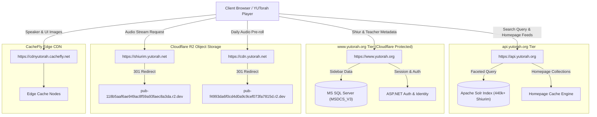

# Official YUTorah API Specification Document
**Version:** 3.0.0  
**Specification Standard:** OpenAPI 3.0.3  
**Target Environments:** `api.yutorah.org` (Microservices/Search), `www.yutorah.org` (Core Application & Sidebar Service), `shiurim.yutorah.net` & `cdnyutorah.cachefly.net` (Media CDNs)  
**Security & Edge Architecture:** Cloudflare Enterprise CDN, Cloudflare Bot Management (Turnstile / Managed Challenges), Cloudflare R2 Object Storage, CacheFly Edge CDN  

---

## Executive Architectural Summary

The YUTorah platform operates a hybrid multi-tiered architecture that separates public indexing and search operations, content delivery, user state management, and media streaming across specialized infrastructure:

1. **Microservice API Tier (`https://api.yutorah.org`)**:
   - Backed by an Apache Solr search cluster and ASP.NET Core microservices.
   - Configured with open Cross-Origin Resource Sharing (`access-control-allow-origin: *`).
   - Serves high-throughput public endpoints: full-text faceted shiur searches (`/search`), aggregated homepage feeds (`/homepage/details`), and calendar/timely study trackers (`/homepage/timely`).
   - **Bot Mitigation Profile**: Excluded from intrusive Cloudflare Managed Challenges / Turnstile Javascript hurdles, permitting direct browser `fetch()` and serverless edge consumption.

2. **Core Portal & Sidebar Gateway (`https://www.yutorah.org`)**:
   - ASP.NET MVC monolithic backend.
   - Provides granular lecture metadata (`/sidebar/lectureData`), speaker bios (`/teachers/sidebar/{id}`), venue profiles (`/venues/sidebar/{id}`), series, and subcategories.
   - Hosts authenticated state endpoints (`/Account/Login`, `/Account/GoogleLogin`, `/Account/UserFavorites`, `/Queue/queue`).
   - **Bot Mitigation Profile**: Standard web endpoints (e.g. `/Search`, `/lectures/details`) enforce aggressive **Cloudflare Bot Management** with interactive Turnstile challenges (`cf-mitigated: challenge`, HTTP 403 on unrecognized headless user agents). Crucially, the legacy AJAX sidebar route `/sidebar/lectureData` returns `access-control-allow-origin: *` and bypasses the challenge for valid query strings.

3. **Global Media Distribution Infrastructure**:
   - **Audio Streams (`https://shiurim.yutorah.net`)**: Resolves audio lecture assets. Automatically issues HTTP `301 Moved Permanently` redirects to Cloudflare R2 object storage (`pub-118b5aaf6ae949ac8f59a93faec8a3da.r2.dev`). Fully supports HTTP `206 Partial Content` (byte-range requests: `Range: bytes=0-`) for scrubbing multi-hour recordings.
   - **Direct Downloads (`https://download.yutorah.org`)**: Direct audio downloads with localized SEO file naming conventions (`/YYYY/{folder}/{shiurId}/{slug}.mp3`).
   - **Daily Sponsorship Media (`https://cdn.yutorah.net`)**: Dynamic daily audio pre-rolls (`/_media/sponsorshipAudio/{MMDDYY}.mp3`), redirecting to dedicated Cloudflare R2 storage (`pub-f4993da6f0cd4d0a9c9cef073fa7815d.r2.dev`).
   - **Static Image Assets (`https://cdnyutorah.cachefly.net`)**: High-performance CacheFly edge CDN serving speaker portraits, roshei yeshiva headshots (`/_images/roshei_yeshiva/{photo}`), location badges, and branding icons with 14-day client cache TTLs.

---

## Architectural Interaction Diagram



---

## 1. Domain Service Matrix

| Domain | Underlying Platform | Primary Purpose | CORS Policy | Cloudflare Turnstile / Bot Mitigation |
| :--- | :--- | :--- | :--- | :--- |
| `https://api.yutorah.org` | ASP.NET Core / Solr Cluster | Full-text search, live collections, timely trackers | `access-control-allow-origin: *` | **Disabled** (Open API access) |
| `https://www.yutorah.org` | ASP.NET MVC / MS SQL | Metadata extraction, teacher/venue sidebars, user auth | `access-control-allow-origin: *` (Sidebar API) | **Active** on web and form routes; **Bypassed** on `/sidebar/*` |
| `https://shiurim.yutorah.net` | Cloudflare R2 Gateway | MP3 stream audio delivery | `access-control-allow-origin: *` | **Disabled** (HTTP 301 to R2 origin) |
| `https://download.yutorah.org` | Cloudflare CDN Storage | Direct MP3 downloads | `access-control-allow-origin: *` | **Disabled** (Content-Disposition binary) |
| `https://cdn.yutorah.net` | Cloudflare R2 Gateway | Daily sponsorship pre-rolls | `access-control-allow-origin: *` | **Disabled** (HTTP 301 to R2 origin) |
| `https://cdnyutorah.cachefly.net` | CacheFly Edge | Static images, speaker photos, logos | `access-control-allow-origin: *` | **Disabled** (Global edge caching) |

---

## 2. Detailed REST Endpoint Specifications

### 2.1 Microservices API: `https://api.yutorah.org`

#### 2.1.1 Full-Text & Faceted Search: `GET /search`
Executes Solr-backed multi-parameter search across over 440,000 Torah lectures. Supports complex boolean operators, phrase matching, speaker filtering, and category narrowing.

- **URL:** `https://api.yutorah.org/search`
- **Method:** `GET`
- **Query Parameters:**
  | Parameter | Type | Required | Default | Description | Example |
  | :--- | :---: | :---: | :---: | :--- | :--- |
  | `searchTerm` | string | No | `""` | Search keywords, title tokens, or speaker name. | `Schachter` or `Pesach` |
  | `start` | integer | No | `1` | 1-based pagination offset. Typically stepped by 30 (`1, 31, 61, 91...`). | `31` |
  | `rows` | integer | No | `30` | Number of documents to return per page. | `20` |
  | `teacherId` | integer | No | None | Restrict results to a specific speaker ID. | `80153` (Rav Schachter) |
  | `subCategoryId` | integer | No | None | Restrict results to a subcategory ID. | `234000` (Shemot) |
  | `locationId` | integer | No | None | Restrict results to a venue/location ID. | `439` (YU Wilf Campus) |
  | `seriesId` | integer | No | None | Restrict results to a specific lecture series. | `4000` (Daily Shiur) |

- **Response Headers:**
  ```http
  HTTP/2 200 OK
  content-type: application/json; charset=utf-8
  access-control-allow-origin: *
  access-control-allow-headers: Content-Type
  access-control-allow-methods: GET, POST, PUT, DELETE, OPTIONS
  cf-cache-status: DYNAMIC
  ```

- **Response Body Structure (`application/json`):**
  ```json
  {
    "SHIURS_NOTEBOOK": null,
    "responseHeader": {
      "status": 0,
      "QTime": 4,
      "params": {
        "q": "Rosensweig",
        "start": "1",
        "rows": "2"
      }
    },
    "response": {
      "numFound": 5167,
      "start": 1,
      "maxScore": 57.58364,
      "docs": [
        {
          "shiurid": 1187585,
          "shiurtitle": "מחלליה מות יומת",
          "teacherid": 81744,
          "teacherfullname": "Rabbi Itamar Rosensweig",
          "teachertype": "YU Students",
          "teacherishidden": [0],
          "PHOTO": "itamar_rosensweig_o.jpg",
          "categoryname": ["Gemara"],
          "categoryshortname": ["Shabbat"],
          "subcategoryname": ["Shabbat"],
          "subcategoryid": [234221],
          "seriesid": [4000],
          "seriesname": ["Daily Shiur"],
          "location": "YU Wilf Campus",
          "organizationid": [301],
          "shiurdate": "2026-09-06T04:00:00Z",
          "shiurdateformatted": "Sep 06, 2026",
          "shiurdatesubmitted": "2026-09-06T04:00:00Z",
          "shiurdatesubmittedformatted": "Sep 06, 2026",
          "duration": 0,
          "durationformatted": null,
          "mediatypename": "MP3",
          "mediatypecategory": "audio",
          "shiurdownloadurl": "https://shiurim.yutorah.net/2026/6516/1187585.MP3?redirect=download.yutorah.org",
          "shiurplayerurl": null,
          "shiurcanbedownloaded": 1,
          "shiurisnew": 1,
          "shiurvisitsnum": 0,
          "shiurdownloadsnum": 0,
          "shiurdescription": "",
          "shiurkeywords": "",
          "language": "EN",
          "score": 1,
          "collectionid": [15361],
          "collectionname": ["Rav Itamar Rosensweig Shabbat 5787|15361|4"],
          "collectiontype": ["teacher"]
        }
      ]
    },
    "facet_counts": {
      "facet_queries": {},
      "facet_fields": {},
      "facet_dates": {},
      "facet_ranges": {}
    }
  }
  ```

---

#### 2.1.2 Homepage Details Aggregation: `GET /homepage/details`
Returns a unified payload powering the primary YUTorah home dashboard, including timely calendar trackers, editor recommendations, daily shiurim, and recent uploads.

- **URL:** `https://api.yutorah.org/homepage/details`
- **Method:** `GET`
- **Response Headers:**
  ```http
  HTTP/2 200 OK
  content-type: application/json; charset=utf-8
  access-control-allow-origin: *
  cf-cache-status: DYNAMIC
  ```

- **Top-Level JSON Schema:**
  | Key | Type | Description |
  | :--- | :---: | :--- |
  | `editorsPicks` | array[ShiurItem] | 10 featured shiurim handpicked by curators. |
  | `recentlyUploaded` | array[ShiurItem] | 10 most recently uploaded lectures. |
  | `recentlyViewed` | array[ShiurItem] | Most viewed lectures in the current 24-hour cycle. |
  | `parshaShiurim` | array[ShiurItem] | Active parsha lectures (empty during special festival weeks). |
  | `dailyShiurim` | array[ShiurItem] | 10 featured daily study shiurim. |
  | `featuredSeries` | array[SeriesItem] | Top 10 curated ongoing study series. |
  | `carousel` | array[BannerItem] | 20 rotating hero banners promoting special events or yahrtzeits. |
  | `slideshow` | array[SlideItem] | 4 interactive featured study items. |
  | `timelyData` | object | Daily study trackers (Parsha, Daf Yomi, Mishna Yomi, Nach Yomi). |
  | `hebrewDateString` | string | Current Hebrew date in Hebrew characters (e.g. `כ״ד אלול תשפ״ו`). |
  | `totalShiurCount` | integer | Total shiur catalog size (e.g. `440535`). |
  | `serverTimeMilliseconds` | integer | Server execution time in milliseconds. |

- **Nested Object Specifications:**
  - **`timelyData` Object:**
    ```json
    {
      "parshaStr": "Ki Teitzei",
      "parshaURL": "/categories/parsha/ki-teitzei",
      "israelParshaStr": "Ki Teitzei",
      "israelParshaURL": "/categories/parsha/ki-teitzei",
      "dafStr": "Chullin 129",
      "mishnaYomiStr": "Keilim 29:2-3",
      "mishnaYomiSubcategoryID": 234949,
      "nachYomiStr": "Yeshayahu 60",
      "nachYomiSubcategoryID": 234877
    }
    ```
  - **`ShiurItem` (Inside `editorsPicks`, `recentlyUploaded`, `dailyShiurim`):**
    ```json
    {
      "shiurID": 1187082,
      "shiurTitle": "The Power of לדוד",
      "shiurDescription": "Analysis of Psalm 27 for the month of Elul.",
      "shiurDate": "2026-09-01T00:00:00",
      "shiurDuration": "46min 19s",
      "shiurTeachers": [
        {
          "teacherID": 81045,
          "teacherFullName": "Rabbi Noach Goldstein",
          "teacherPhotoURL": "https://cdnyutorah.cachefly.net/_images/roshei_yeshiva/noach_goldstein.jpg"
        }
      ],
      "shiurGroupedSubcategoriesObj": [
        {
          "categoryShortName": "Elul",
          "subcategoryId": 235059
        }
      ],
      "downloadURL": "https://download.yutorah.org/2026/21083/1187082/the-power-of-ledavid.mp3",
      "playerDownloadURL": "https://shiurim.yutorah.net/2026/21083/1187082.MP3"
    }
    ```

---

#### 2.1.3 Dedicated Timely Study Feed: `GET /homepage/timely`
Lightweight microservice endpoint returning only the daily study trackers and hebrew date, used for header bars without incurring the overhead of loading full collection payloads.

- **URL:** `https://api.yutorah.org/homepage/timely`
- **Method:** `GET`
- **Response Format:** Same format as the `timelyData` object documented in 2.1.2.

---

#### 2.1.4 Catalog Facet Discovery & Navigation API: `GET /search?searchTerm=*&rows=0&facet=true`
Powers YUTorah's global hamburger navigation menu, catalog browsing, and autocomplete indexes across all seven taxonomy dimensions. By executing an open wildcard search (`*`) with zero rows returned and facet counting enabled, this endpoint returns complete counts and identifiers for all 440,000+ indexed lectures.

- **URL:** `https://api.yutorah.org/search?searchTerm=*&rows=0&facet=true`
- **Method:** `GET`
- **Response Headers:**
  ```http
  HTTP/2 200 OK
  content-type: application/json; charset=utf-8
  access-control-allow-origin: *
  cf-cache-status: DYNAMIC
  ```

- **Top-Level Structure:**
  ```json
  {
    "response": {
      "numFound": 440535,
      "start": 0,
      "maxScore": 0.0,
      "docs": []
    },
    "facet_counts": {
      "facet_queries": {},
      "facet_fields": {
        "teachers": [...],
        "subcategories": [...],
        "locations": [...],
        "series": [...],
        "publications": [...],
        "publicationVolumes": [...],
        "collections": [...],
        "languages": [...],
        "mediaTypeCategory": [...]
      }
    }
  }
  ```

- **Catalog Dimensions Detailed Schemas:**
  1. **Teachers (`teachers`) — 3,254 Speakers:**
     ```json
     {
       "TeacherName": "Lebowitz, R' Aryeh",
       "TeacherId": 80714,
       "TeacherLastName": "Lebowitz",
       "Match": 15001
     }
     ```
  2. **Categories & Subcategories (`subcategories`) — 601 Topics:**
     Hierarchically maps main categories (Halacha, Gemara, Tanach, Machshava, Chagim, Jewish History) into granular subcategories.
     ```json
     {
       "categoryName": "Halacha",
       "Subcategoryname": "Shabbat",
       "SubcategoryId": 234071,
       "Match": 16674
     }
     ```
  3. **Locations / Venues (`locations`) — 405 Recording Venues:**
     ```json
     {
       "LocationName": "YU Wilf Campus",
       "LocationId": 439,
       "Match": 32430
     }
     ```
  4. **Series (`series`) — 49 Lecture Series:**
     ```json
     {
       "SeriesName": "Daf Yomi",
       "SeriesId": 4031,
       "Match": 48142
     }
     ```
  5. **Publications (`publications`) — 43 Journal & Torah Booklet Editions:**
     ```json
     {
       "PublicationName": "To-Go",
       "PublicationId": 229,
       "Match": 1421
     }
     ```
  6. **Publication Volumes (`publicationVolumes`) — 419 Volumes:**
     ```json
     {
       "PublicationName": "Volume 1",
       "PublicationVolumeId": 20282,
       "PublicationVolume": "Volume 1",
       "Match": 827
     }
     ```
  7. **Curated Collections (`collections`) — 13,289 Curated Playlists:**
     ```json
     {
       "CollectionName": "R' Jonathan Schwartz Mishna Yomis",
       "CollectionId": 6536,
       "Match": 2282
     }
     ```

- **Hamburger Menu Navigation Architecture Mapping:**
  On `www.yutorah.org`, the top-left hamburger navigation menu (`☰`) renders links that correspond directly to these seven facet dimensions:
  - `Categories`: Expands dynamically into Halacha, Gemara, Tanach, Machshava, Chagim, and Jewish History. Selecting any subcategory opens `/search?subCategoryId={id}` or navigates to `/categories/sidebar/{id}`.
  - `Teachers`: Links to `/teachers`, where users can search across the 3,254 faculty profiles. Selecting a teacher queries `/search?teacherId={id}`.
  - `Venues`: Links to `/venues`, allowing venue search across 405 institutions. Selecting a venue queries `/search?locationId={id}`.
  - `Series`: Links to `/series`, searching across the 49 recurring series (e.g. Daf Yomi, Daily Shiur, BCBM). Queries `/search?seriesId={id}`.
  - `Publications`: Links to `/publications`, searching across the 43 journal publications (e.g. To-Go, Beit Yitzchak, Kol Zvi). Queries `/search?publicationId={id}` or `searchTerm=To-Go`.

---

### 2.2 Core Application & Sidebar Microservices: `https://www.yutorah.org`

#### 2.2.1 Lecture Comprehensive Data: `GET /sidebar/lectureData`
The primary metadata endpoint utilized by audio and video players to retrieve stream targets, timestamps, chapter notes, teacher profiles, categorizations, and contextual recommendations.

- **URL:** `https://www.yutorah.org/sidebar/lectureData`
- **Method:** `GET`
- **Query Parameters:**
  | Parameter | Type | Required | Description | Example |
  | :--- | :---: | :---: | :--- | :--- |
  | `shiurId` (or `shiurID`) | integer | **Yes** | Unique identifier of the shiur. | `1187082` |

- **Response Headers:**
  ```http
  HTTP/2 200 OK
  content-type: application/json; charset=utf-8
  access-control-allow-origin: *
  access-control-allow-headers: Content-Type
  access-control-allow-methods: GET, POST, PUT, DELETE, OPTIONS
  x-stackifyid: V2|...
  ```

- **Selected Response Fields:**
  | Field | Type | Description |
  | :--- | :---: | :--- |
  | `shiurID` | integer | Canonical identifier of the shiur. |
  | `shiurTitle` | string | Full title string. |
  | `shiurTeacherFullName`| string | Display name of the primary speaker. |
  | `shiurTeachers` | array[object] | Array containing `{ teacherID, teacherFullName, teacherPhotoURL, teacherPhotoURL_lp }`. |
  | `shiurDuration` | string | Formatted duration string (e.g. `46min 19s`). |
  | `shiurMediaLengthInSeconds`| integer| Exact integer playback duration in seconds (e.g. `2779`). |
  | `playerDownloadURL` | string | Streaming audio URL on `shiurim.yutorah.net`. |
  | `downloadURL` | string | Direct download URL on `download.yutorah.org`. |
  | `shiurURL` | string | Relative file path on audio CDN (e.g. `/2026/21083/1187082.MP3`). |
  | `mediaTypeCategory` | string | Media type: `"audio"` or `"video"`. |
  | `mediaTypeName` | string | Container format: `"MP3"` or `"MP4"`. |
  | `postedInCategories` | object | Grouped category mapping (e.g. keys `"608"` (Machshava), `"612"` (Halacha)). |
  | `postedInLocations` | array[object] | Hosting locations `{ locationID, locationName }`. |
  | `shiurKeywords` | array[object] | Tags and keywords `{ keywordTitle }`. |
  | `moreFromSpeakers` | array[object] | Next recommended shiurim by the same speaker. |
  | `moreFromCategories` | array[object] | Related shiurim within identical subcategories. |
  | `shiurDateFormatted` | string | ISO Date string (`YYYY-MM-DD`). |

---

#### 2.2.2 Speaker Sidebar Profile: `GET /teachers/sidebar/{teacherId}`
Returns detailed biographic information, portrait assets, and HTML snippets of recently delivered and all-time top shiurim for the designated scholar.

- **URL:** `https://www.yutorah.org/teachers/sidebar/{teacherId}`
- **Method:** `GET`
- **Path Parameters:**
  - `teacherId` (integer, required): e.g. `80153` (Rabbi Hershel Schachter), `80146` (Rabbi Michael Rosensweig).
- **Response Format:**
  ```json
  {
    "teacherID": 80153,
    "teacherFullName": "Rabbi Hershel Schachter",
    "teacherBio": "Rabbi Schachter, a noted Talmudic scholar...",
    "teacherPhotoURL": "https://cdnyutorah.cachefly.net/_images/roshei_yeshiva/hershel_schachter_lp.jpg",
    "teacherPhotoURL_lp": "https://cdnyutorah.cachefly.net/_images/roshei_yeshiva/hershel_schachter_lp.jpg",
    "landingPageURL": "https://www.yutorah.org/teachers/Rabbi-Hershel-Schachter/",
    "searchURL": "https://www.yutorah.org/search/?teacher=80153",
    "topLecturesHTMLSnippet": "<ul class=\"top-lectures\">...</ul>",
    "recentlyAddedLecturesHTMLSnippet": "<ul class=\"recently-added\">...</ul>"
  }
  ```

---

#### 2.2.3 Venue Profile: `GET /venues/sidebar/{venueId}`
Returns institutional venue details, street address, and lecture activity metrics.

- **URL:** `https://www.yutorah.org/venues/sidebar/{venueId}`
- **Method:** `GET`
- **Path Parameters:**
  - `venueId` (integer, required): e.g. `439` (YU Wilf Campus), `738` (Belz School of Jewish Music).
- **Response Fields:**
  ```json
  {
    "locationID": 439,
    "locationName": "YU Wilf Campus",
    "locationPhotoURL": "https://cdnyutorah.cachefly.net/_images/locations/wilf.jpg",
    "landingPageURL": "https://www.yutorah.org/venues/YU-Wilf-Campus/",
    "searchURL": "https://www.yutorah.org/search/?location=439",
    "title": "YU Wilf Campus",
    "locationDescription": ""
  }
  ```

---

#### 2.2.4 Category & Series Sidebars
- **Subcategories:** `GET https://www.yutorah.org/categories/sidebar/{subcategoryId}`
  - Returns `categoryName`, `subcategoryID`, `subcategoryName`, `numShiurim`, and `topLectures`.
- **Series:** `GET https://www.yutorah.org/series/sidebar/{seriesId}`
  - Returns `seriesID`, `seriesName`, `seriesDescription`, `seriesPhotoURL`, and `numShiurim`.

---

#### 2.2.5 User Favorites Synchronization: `POST /Account/UserFavorites`
Manages personal user bookmarks across speakers, series, venues, and collections.

- **URL:** `https://www.yutorah.org/Account/UserFavorites`
- **Method:** `POST`
- **Authentication:** Requires `YUTorahWeb` session cookie.
- **Content-Type:** `application/x-www-form-urlencoded`
- **Request Body Parameters:**
  | Parameter | Type | Allowed Values | Description |
  | :--- | :---: | :---: | :--- |
  | `action` | string | `"none"`, `"add"`, `"remove"` | Mutation action. `"none"` performs a read query. |
  | `myFavoriteType` | string | `"teacher"`, `"series"`, `"location"`, `"collection"`, `"none"` | Entity type to bookmark. |
  | `myFavoriteID` | integer | e.g. `80153`, `4000` | ID of the teacher, series, or venue. |

- **Response Body (`application/json`):**
  ```json
  {
    "myFavoriteTeachers": [
      {
        "teacherID": 80153,
        "teacherFullName": "Rabbi Hershel Schachter",
        "teacherPhotoURL": "https://cdnyutorah.cachefly.net/_images/roshei_yeshiva/hershel_schachter.jpg"
      }
    ],
    "myFavoriteSeries": [],
    "myFavoriteLocations": [],
    "myFavoritePublications": [],
    "myFavoriteCollections": [],
    "myCustomCollections": [],
    "errorMessage": ""
  }
  ```

---

#### 2.2.6 Playback Queue & Bookmarking: `GET|POST /Queue/queue`
Maintains user playback state, play later queues, and playback history with second-level timestamps.

- **URL:** `https://www.yutorah.org/Queue/queue`
- **Method:** `GET` / `POST`
- **Query / Form Parameters:**
  | Parameter | Type | Values | Purpose |
  | :--- | :---: | :---: | :--- |
  | `action` | string | `"get"`, `"add"`, `"remove"` | Operation action. |
  | `bookmarkType` | string | `"queue"`, `"history"`, `"articles"` | Target list. |
  | `shiurID` | integer | ID or `0` | Target shiur ID. |
  | `sortIndex` | integer | `0` | Sort ordering flag. |
  | `historySearchTerm` | string | `""` | Optional filter keyword. |

- **Response Payload (`application/json`):**
  ```json
  {
    "data": {
      "shiurQueue": [
        {
          "shiurID": 1187082,
          "shiurTitle": "The Power of לדוד",
          "usbBookmarkTimeStamp": "00:14:32"
        }
      ]
    },
    "isError": false,
    "errorMessage": ""
  }
  ```

---

#### 2.2.7 Authentication Endpoints
- **Standard Credential Login:** `POST https://www.yutorah.org/Account/Login`
  - **Payload:** `loginUsername={usernameOrEmail}&loginPassword={password}&keepMeLoggedIn=1`
  - **Success Response:** HTTP 200 JSON `{ "pageFrom": "/lectures/...", "errorMessage": "" }` + Set-Cookie `YUTorahWeb=...; Domain=.yutorah.org; Path=/; HttpOnly; SameSite=Lax`.
  - **Protection:** Protected by Cloudflare Managed Challenges when accessed from unrecognized automated user-agents.
- **Social OAuth:**
  - `GET https://www.yutorah.org/Account/GoogleLogin`
  - `GET https://www.yutorah.org/Account/FacebookLogin`
  - Initiates 302 redirection to Google/Facebook OAuth consent screens, returning to `/Account/ExternalLoginCallback`.

---

## 3. Media CDN Distribution Infrastructure

### 3.1 Audio Storage Architecture (`https://shiurim.yutorah.net`)
Audio assets are identified by a path convention encoding the upload year, institutional/venue ID, and Shiur ID:
```text
https://shiurim.yutorah.net/{YYYY}/{FolderID}/{ShiurID}.MP3
```

- **HTTP 301 Edge Redirect:**
  When a request hits `shiurim.yutorah.net`, the Cloudflare Edge performs an automatic HTTP 301 redirection to an internal Cloudflare R2 bucket:
  ```http
  HTTP/2 301 Moved Permanently
  Location: https://pub-118b5aaf6ae949ac8f59a93faec8a3da.r2.dev/{YYYY}/{FolderID}/{ShiurID}.MP3
  access-control-allow-origin: *
  ```
- **Byte-Range Seeking (`HTTP 206 Partial Content`):**
  The R2 origin honors the `Range` request header, returning `Accept-Ranges: bytes` and `Content-Range: bytes 0-1048575/16679518`. This allows HTML5 audio players to instantly scrub to any playback timestamp without pre-buffering the full file.

### 3.2 Static Asset Delivery (`https://cdnyutorah.cachefly.net`)
Delivers static visual assets:
- **Roshei Yeshiva & Speakers:** `https://cdnyutorah.cachefly.net/_images/roshei_yeshiva/{filename}.jpg`
- **Large Portraits:** `https://cdnyutorah.cachefly.net/_images/roshei_yeshiva/{filename}_lp.jpg`
- **Default Placeholder:** `https://cdnyutorah.cachefly.net/_images/roshei_yeshiva/_default.jpg`
- **Campuses & Venues:** `https://cdnyutorah.cachefly.net/_images/locations/{location_name}.jpg`
- **Branding Assets:** `https://cdnyutorah.cachefly.net/public/v3/images/logo-university-2x.png`
- **Caching Policy:** CacheFly sets `cache-control: max-age=1209600` (14 days) with CORS enabled.

### 3.3 Daily Sponsorship Audio (`https://cdn.yutorah.net`)
Daily audio pre-rolls sponsored by donors are generated based on the current New York calendar date:
```text
https://cdn.yutorah.net/_media/sponsorshipAudio/{MMDDYY}.mp3
```
- E.g. For September 6, 2026: `https://cdn.yutorah.net/_media/sponsorshipAudio/090626.mp3`
- Issues a 301 redirect to R2 storage (`pub-f4993da6f0cd4d0a9c9cef073fa7815d.r2.dev`).

---

## 4. Bot Mitigation & Cloudflare Edge Behaviors

### 4.1 Comparison: `api.yutorah.org` vs `www.yutorah.org`

| Parameter | `api.yutorah.org` | `www.yutorah.org` |
| :--- | :--- | :--- |
| **Zone Management** | Cloudflare CDN & Reverse Proxy | Cloudflare Enterprise + Turnstile / Managed Challenges |
| **WAF / Bot Mitigation** | **Permissive / Open**: Zero Javascript challenges or CAPTCHAs on standard API paths. | **Enforced**: Non-browser HTTP clients attempting to load `/Search` or `/Account/*` encounter `cf-mitigated: challenge` (HTTP 403). |
| **Whitelisted Endpoints** | All endpoints (`/search`, `/homepage/details`, `/homepage/timely`) are public. | `/sidebar/lectureData`, `/teachers/sidebar/*`, `/venues/sidebar/*` bypass Turnstile and return open CORS. |
| **User Agent Sensitivity** | None. Standard `User-Agent` headers (including curl, Python, or edge worker) receive HTTP 200. | Sensitive. Browser user-agents are expected. Valid crawler user-agent (Googlebot) receives raw HTML for SEO indexing. |

### 4.2 Cloudflare Worker Proxy Pattern
The YUTorah Player project utilizes a Cloudflare Worker edge layer (`src/worker.js`) to provide enhanced client isolation, edge caching, and server-side link unfurling:
1. **Edge Cache Layer**: Caches `/homepage/details` in worker memory for 5 minutes (`300000ms`), shielding YUTorah backend servers from redundant traffic.
2. **Sponsorship Parsing**: Scrapes and caches daily dedication text and audio pre-rolls with a 10-minute fallback TTL.
3. **Rich Open Graph Metadata**: Inspects incoming `/lectures/{id}` or `/{id}` paths, fetches `/sidebar/lectureData` at the edge, and dynamically injects `<meta property="og:title">` and `<meta property="og:image">` tags so shared links in iMessage, WhatsApp, and Slack display high-resolution speaker portraits.
4. **Header Normalization**: Strips restrictive upstream security headers and normalizes `Access-Control-Allow-Origin: *` across all proxied API responses.

---

## 5. OpenAPI 3.0.3 Formal Specification (YAML)

Below is the complete OpenAPI 3.0.3 YAML schema documenting the public and discovered endpoints:

```yaml
openapi: 3.0.3
info:
  title: YUTorah Online Public & Microservice API
  version: 3.0.0
  description: >
    Official technical specification for the YUTorah Online platform, encompassing
    microservice search endpoints on `api.yutorah.org`, lecture and teacher metadata
    on `www.yutorah.org`, and audio/asset CDN services.
servers:
  - url: https://api.yutorah.org
    description: Primary Microservice & Search Cluster
  - url: https://www.yutorah.org
    description: Core Portal & Sidebar Service
  - url: https://shiurim.yutorah.net
    description: Global Audio Streaming CDN (Redirects to Cloudflare R2)
  - url: https://cdnyutorah.cachefly.net
    description: Static Image & Portrait Edge CDN

paths:
  /search:
    get:
      summary: Search Lectures Catalog (Solr)
      description: Searches over 440,000 Torah lectures using Solr full-text and faceted search.
      parameters:
        - name: searchTerm
          in: query
          description: Search keywords or speaker names.
          required: false
          schema:
            type: string
            example: "Schachter"
        - name: start
          in: query
          description: 1-based pagination offset.
          required: false
          schema:
            type: integer
            default: 1
            example: 1
        - name: rows
          in: query
          description: Result batch size.
          required: false
          schema:
            type: integer
            default: 30
            example: 30
        - name: teacherId
          in: query
          description: Filter by specific speaker ID.
          required: false
          schema:
            type: integer
            example: 80153
        - name: subCategoryId
          in: query
          description: Filter by specific subcategory ID.
          required: false
          schema:
            type: integer
            example: 234000
        - name: locationId
          in: query
          description: Filter by venue/location ID.
          required: false
          schema:
            type: integer
            example: 439
        - name: seriesId
          in: query
          description: Filter by lecture series ID.
          required: false
          schema:
            type: integer
            example: 4000
      responses:
        '200':
          description: Successful Solr search query.
          content:
            application/json:
              schema:
                $ref: '#/components/schemas/SolrSearchResponse'

  /homepage/details:
    get:
      summary: Get Homepage Collections & Featured Content
      description: Returns live collections, popular lectures, daily shiurim, and study trackers.
      responses:
        '200':
          description: Aggregated homepage payload.
          content:
            application/json:
              schema:
                $ref: '#/components/schemas/HomepageDetailsResponse'

  /homepage/timely:
    get:
      summary: Get Daily Study Trackers
      description: Returns Daf Yomi, Mishna Yomi, Nach Yomi, and Parsha information.
      responses:
        '200':
          description: Timely study trackers.
          content:
            application/json:
              schema:
                $ref: '#/components/schemas/TimelyData'

  /sidebar/lectureData:
    get:
      summary: Get Complete Shiur Metadata
      description: Returns audio stream targets, duration, speaker photos, and categories.
      servers:
        - url: https://www.yutorah.org
      parameters:
        - name: shiurId
          in: query
          description: Canonical unique identifier of the lecture.
          required: true
          schema:
            type: integer
            example: 1187082
      responses:
        '200':
          description: Detailed lecture metadata.
          content:
            application/json:
              schema:
                $ref: '#/components/schemas/LectureDataResponse'

  /teachers/sidebar/{teacherId}:
    get:
      summary: Get Teacher Profile Sidebar
      description: Returns speaker bio, photo URLs, and recent lectures.
      servers:
        - url: https://www.yutorah.org
      parameters:
        - name: teacherId
          in: path
          description: Teacher ID.
          required: true
          schema:
            type: integer
            example: 80153
      responses:
        '200':
          description: Teacher bio and metadata.
          content:
            application/json:
              schema:
                $ref: '#/components/schemas/TeacherSidebarResponse'

  /venues/sidebar/{venueId}:
    get:
      summary: Get Venue Profile Sidebar
      description: Returns venue name, address, and lecture counts.
      servers:
        - url: https://www.yutorah.org
      parameters:
        - name: venueId
          in: path
          description: Venue / Location ID.
          required: true
          schema:
            type: integer
            example: 439
      responses:
        '200':
          description: Venue details.
          content:
            application/json:
              schema:
                $ref: '#/components/schemas/VenueSidebarResponse'

  /Account/UserFavorites:
    post:
      summary: Get or Update User Favorites
      description: Manages favorite teachers, series, locations, and collections.
      servers:
        - url: https://www.yutorah.org
      requestBody:
        required: true
        content:
          application/x-www-form-urlencoded:
            schema:
              type: object
              properties:
                action:
                  type: string
                  enum: [none, add, remove]
                  default: none
                myFavoriteType:
                  type: string
                  enum: [teacher, series, location, collection, none]
                  default: none
                myFavoriteID:
                  type: integer
                  default: 0
      responses:
        '200':
          description: Current user favorite lists.
          content:
            application/json:
              schema:
                $ref: '#/components/schemas/UserFavoritesResponse'

  /Queue/queue:
    get:
      summary: Fetch Playback Queue & History
      description: Retrieves the user bookmark list, play-later queue, or listening history.
      servers:
        - url: https://www.yutorah.org
      parameters:
        - name: action
          in: query
          schema:
            type: string
            enum: [get, add, remove]
            default: get
        - name: bookmarkType
          in: query
          schema:
            type: string
            enum: [queue, history, articles]
            default: queue
        - name: shiurID
          in: query
          schema:
            type: integer
            default: 0
      responses:
        '200':
          description: Queue dataset.
          content:
            application/json:
              schema:
                type: object
                properties:
                  data:
                    type: object
                  isError:
                    type: boolean
                  errorMessage:
                    type: string

components:
  schemas:
    SolrSearchResponse:
      type: object
      properties:
        responseHeader:
          type: object
          properties:
            status:
              type: integer
            QTime:
              type: integer
        response:
          type: object
          properties:
            numFound:
              type: integer
            start:
              type: integer
            maxScore:
              type: number
            docs:
              type: array
              items:
                $ref: '#/components/schemas/SolrDoc'

    SolrDoc:
      type: object
      properties:
        shiurid:
          type: integer
        shiurtitle:
          type: string
        teacherid:
          type: integer
        teacherfullname:
          type: string
        PHOTO:
          type: string
        categoryname:
          type: array
          items:
            type: string
        subcategoryname:
          type: array
          items:
            type: string
        location:
          type: string
        shiurdateformatted:
          type: string
        durationformatted:
          type: string
          nullable: true
        shiurdownloadurl:
          type: string

    HomepageDetailsResponse:
      type: object
      properties:
        editorsPicks:
          type: array
          items:
            $ref: '#/components/schemas/ShiurSummary'
        recentlyUploaded:
          type: array
          items:
            $ref: '#/components/schemas/ShiurSummary'
        dailyShiurim:
          type: array
          items:
            $ref: '#/components/schemas/ShiurSummary'
        featuredSeries:
          type: array
          items:
            $ref: '#/components/schemas/SeriesSummary'
        timelyData:
          $ref: '#/components/schemas/TimelyData'
        hebrewDateString:
          type: string
        totalShiurCount:
          type: integer

    TimelyData:
      type: object
      properties:
        parshaStr:
          type: string
        parshaURL:
          type: string
        dafStr:
          type: string
        mishnaYomiStr:
          type: string
        mishnaYomiSubcategoryID:
          type: integer
        nachYomiStr:
          type: string
        nachYomiSubcategoryID:
          type: integer

    ShiurSummary:
      type: object
      properties:
        shiurID:
          type: integer
        shiurTitle:
          type: string
        shiurDuration:
          type: string
        downloadURL:
          type: string
        playerDownloadURL:
          type: string
        shiurTeachers:
          type: array
          items:
            type: object
            properties:
              teacherID:
                type: integer
              teacherFullName:
                type: string
              teacherPhotoURL:
                type: string

    SeriesSummary:
      type: object
      properties:
        seriesID:
          type: integer
        name:
          type: string
        description:
          type: string
        imageURL:
          type: string
        numShiurim:
          type: integer

    LectureDataResponse:
      type: object
      properties:
        shiurID:
          type: integer
        shiurTitle:
          type: string
        shiurTeacherFullName:
          type: string
        shiurDuration:
          type: string
        shiurMediaLengthInSeconds:
          type: integer
        playerDownloadURL:
          type: string
        downloadURL:
          type: string
        shiurURL:
          type: string
        mediaTypeCategory:
          type: string
          enum: [audio, video]
        mediaTypeName:
          type: string
          enum: [MP3, MP4]
        shiurDateFormatted:
          type: string
        shiurTeachers:
          type: array
          items:
            type: object
            properties:
              teacherID:
                type: integer
              teacherFullName:
                type: string
              teacherPhotoURL:
                type: string
        moreFromSpeakers:
          type: array
          items:
            $ref: '#/components/schemas/ShiurSummary'
        moreFromCategories:
          type: array
          items:
            $ref: '#/components/schemas/ShiurSummary'

    TeacherSidebarResponse:
      type: object
      properties:
        teacherID:
          type: integer
        teacherFullName:
          type: string
        teacherBio:
          type: string
        teacherPhotoURL:
          type: string
        teacherPhotoURL_lp:
          type: string
        landingPageURL:
          type: string
        searchURL:
          type: string

    VenueSidebarResponse:
      type: object
      properties:
        locationID:
          type: integer
        locationName:
          type: string
        locationPhotoURL:
          type: string
        landingPageURL:
          type: string
        searchURL:
          type: string

    UserFavoritesResponse:
      type: object
      properties:
        myFavoriteTeachers:
          type: array
          items:
            type: object
        myFavoriteSeries:
          type: array
          items:
            type: object
        myFavoriteLocations:
          type: array
          items:
            type: object
        errorMessage:
          type: string
```

---

## 6. Implementation Notes for Frontend & Integration Engineers

1. **Direct Browser Requests (Zero CORS Hurdles):**
   Frontend developers can query `https://api.yutorah.org/search`, `https://api.yutorah.org/homepage/details`, and `https://www.yutorah.org/sidebar/lectureData?shiurId={id}` directly from client-side JavaScript without requiring a custom CORS proxy server, as all three endpoints emit wildcard `Access-Control-Allow-Origin: *`.
2. **Media Scrubbing & Audio Element Integration:**
   Always point `<audio>` tags directly to `playerDownloadURL` (`https://shiurim.yutorah.net/...`). Do not attempt to pre-download the file through standard `fetch()`. The native HTML5 media engine will follow the 301 redirect to the Cloudflare R2 bucket and automatically leverage `Range: bytes=` requests for instant seeking.
3. **Bot Mitigation Safeguards:**
   Do **not** execute automated screen scraping against `https://www.yutorah.org/Search` or `https://www.yutorah.org/lectures/*`. Cloudflare Turnstile blocks automated scripts without interactive cookies. Instead, use the open REST API equivalents (`https://api.yutorah.org/search` and `https://www.yutorah.org/sidebar/lectureData`).
