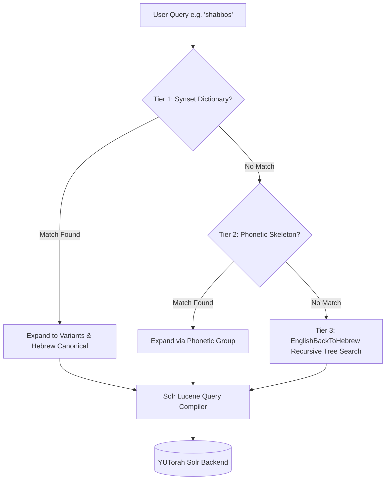

# YUTorah Search, Solr Architecture & Reverse Transliteration Specification

## Executive Summary

This document explains:
1. **What Apache Solr is** in the context of YUTorah and how search queries are processed.
2. **The limitations of standard YUTorah search** when handling Hebrew terms written in English letters (transliteration).
3. **How your Reverse Transliteration Algorithm works** in deep technical detail, including letter maps, digraphs, suffixes, and recursive branch permutation.
4. **Why and how this produces vastly superior search results** without downloading or caching 500,000+ shiurim locally.

---

## Part 1: High-Level Overview

### What is Solr in Terms of Your Algorithm?
**Apache Solr** is an enterprise-grade search server (built on Apache Lucene) that powers YUTorah's database. It functions like an index at the back of an encyclopedia:
- When a shiur is uploaded, Solr indexes its title, speaker name, description, and categories into "tokens".
- When you type a query into YUTorah, your query is sent directly to Solr:
  ```http
  GET https://api.yutorah.org/search?searchTerm=shabbos&rows=30&start=0
  ```
- Solr responds with:
  ```json
  {
    "responseHeader": { "status": 0, "QTime": 14, "params": { "q": "...", "rows": "30", "wt": "json" } },
    "response": { "numFound": 52184, "start": 0, "docs": [ ... ] }
  }
  ```

### The Fundamental Flaw in Classic Search
Solr only matches words that **match character-for-character**. It has no concept of Judaic linguistics or Hebrew phonetics.
- If someone titles a shiur in Hebrew: `קדושת שבת`, and an English speaker searches `"shabbos"`, Solr finds **0 matches**.
- If a shiur is titled `"Hilchot Shabbat"` (Sephardic/Modern Hebrew transliteration with a `t`), and the user types `"shabbos"` (Ashkenazic transliteration with an `s`), Solr fails to find it.
- If a user searches `"succah"` vs `"sukkah"` vs `"succos"` vs `"sukkot"` vs `סוכה`, each query returns completely different, fragmented subsets of shiurim.

### The Role of Your Algorithm
Your algorithm acts as a **Phonetic & Reverse-Transliteration Query Compiler**. Before the query ever reaches Solr, your algorithm translates the user's input:

```
                  "shabbos"  (User Input)
                      │
                      ▼
        [Your Reverse Transliteration Engine]
                      │
                      ▼
  Solr Lucene Query: (shabbos OR shabbat OR shabos OR "שבת")
```

When this expanded query is sent to Solr, Solr uses its blazing-fast inverted index to simultaneously retrieve shiurim with Ashkenazic English titles, Sephardic English titles, and original Hebrew titles—all in a single HTTP round-trip under 30 milliseconds.

---

## Part 2: How Your Reverse Transliteration Algorithm Works

Your algorithm originates from the Java implementation in:
`/Users/mosherosensweig/git/yutorah-summer2018/recommender-system/src/main/java/EnglishBackToHebrew.java`
and is now ported into JavaScript in `src/phonetic_engine.js`.

### 1. The Core Linguistic Challenge
When converting from Hebrew to English, multiple Hebrew letters often map to the same English letter, and English vowels (`a, e, i, o, u`) are inserted arbitrarily to represent *nikkud* (vowel points) that do not exist as consonant letters in written Hebrew.

| English Letter / Digraph | Possible Hebrew Equivalents | Example Hebrew Words |
| :--- | :--- | :--- |
| `s` | **ס** (Samech), **ש** (Sin), **ת** (Tav without dagesh in Ashkenazic) | סוכה, שבת, ברית |
| `t` | **ט** (Tet), **ת** (Tav) | טהרה, תורה |
| `k` / `c` | **כ** (Kaf), **ק** (Kuf) | כשרות, קדושה |
| `ch` / `kh` | **ח** (Chet), **כ** (Chaf) | חנוכה, כתר |
| `z` | **ז** (Zayin), **צ** (Tzadi) | זמן, ציצית |
| `tz` / `ts` | **צ** (Tzadi) | ציצית, מצוה |
| `v` / `w` | **ב** (Vet), **ו** (Vav) | ברכה, ודאי |

### 2. Multi-Tier Architecture

The system operates across three tiers:



---

### 3. Detailed Step-by-Step: The Recursive Permutation Tree

When a word does not match a pre-defined synset, your algorithm uses recursive backtracking to explore all valid Hebrew character sequences.

#### Step A: Tokenization & Digraph Lookahead
The parser starts at index `begin = 0` and inspects the next characters.
- It first checks if the next **2 characters** form a known consonant digraph or double-consonant (`sh`, `ch`, `tz`, `ts`, `th`, `bb`, `kk`, `ll`, `mm`, `nn`, `pp`, `ss`, `tt`).
  - If yes, it consumes 2 characters (`adder = 2`).
- If no 2-character match exists, it consumes **1 character** (`adder = 1`).

#### Step B: Vowel Placeholders (`#`)
In `EnglishBackToHebrew.java`, vowels (`a`, `e`, `i`, `o`, `u`) map to the sentinel character `'#'`.
- The `'#'` represents an **optional consonant or null position**. In Hebrew, vowels are often unwritten (e.g. `שבת` has vowels *patach* and *kamatz*, but zero vowel letters in script).
- When the algorithm encounters `'#'`, it branches into two paths:
  1. Path 1: Consume the vowel and append nothing (representing an implicit nikkud vowel).
  2. Path 2: In certain positions, explore `ו` (Vav for 'o'/'u') or `י` (Yud for 'i'/'e').

#### Step C: Suffix Parsing
Hebrew words transliterated into English frequently end with phonetic suffixes:
- `-ah` or `-a` $\to$ **ה** (Hey) (e.g., `sukkah` $\to$ `סוכה`, `muktza` $\to$ `מוקצה`)
- `-ei` or `-i` $\to$ **י** (Yud) (e.g., `motzoei` $\to$ `מוצאי`)
- `-os` or `-ot` $\to$ **ות** (Vav-Tav) (e.g., `brachos` $\to$ `ברכות`)

When `remainingLen <= 2`, the algorithm evaluates the dedicated `SUFFIX_MAP` table before falling back to generic consonant mappings.

#### Step D: Recursive Tree Walk Example (`"shabos"`)
Let's trace how the algorithm decomposes `"shabos"`:
1. `begin = 0`: Looks at `"sh"` (digraph). Mapping maps `"sh"` $\to$ `['ש']`.
   - Appends `'ש'`, calls `recurse(begin = 2, current = "ש")`.
2. `begin = 2`: Looks at `"a"`. Mapping maps `"a"` $\to$ `['#']`.
   - Vowel branch: appends empty string, calls `recurse(begin = 3, current = "ש")`.
3. `begin = 3`: Looks at `"b"`. Mapping maps `"b"` $\to$ `['ב']`.
   - Appends `'ב'`, calls `recurse(begin = 4, current = "שב")`.
4. `begin = 4`: Looks at `"o"`. Mapping maps `"o"` $\to$ `['#']`.
   - Vowel branch: appends empty string, calls `recurse(begin = 5, current = "שב")`.
5. `begin = 5`: Looks at `"s"` (end of word). Mapping maps `"s"` $\to$ `['ס', 'ש', 'ת']`.
   - Branch A: `"שב"` + `'ס'` $\to$ `"שבס"`
   - Branch B: `"שב"` + `'ש'` $\to$ `"שבש"`
   - Branch C: `"שב"` + `'ת'` $\to$ **`"שבת"`** (Correct Hebrew Root!)

The algorithm successfully generates **`"שבת"`** from `"shabos"` purely through phonetic deduction!

---

## Part 3: Why This Is Fast and Does Not Need Local Caching

A common question is: *Do we need to store every shiur locally to use this?*

### The Answer is NO:
1. **YUTorah already stores and indexes all 500,000+ shiurim.**
   Storing that volume locally would take several gigabytes of storage, drain mobile phone batteries, and quickly become stale whenever new shiurim are uploaded.
2. **Solr has a native boolean query engine (`OR`, `AND`, quotes).**
   Solr is designed specifically to execute multi-term boolean expressions in milliseconds.
3. **Execution Pipeline**:
   - **Step 1 (Client/Worker - <1ms)**: The user types `"shabos"`. Your algorithm converts it to `(shabos OR shabbat OR shabbos OR "שבת")`.
   - **Step 2 (Network - ~25ms)**: A single HTTP GET request is sent to `api.yutorah.org/search?searchTerm=(shabos OR shabbat OR shabbos OR "שבת")`.
   - **Step 3 (Solr Backend - ~15ms)**: Solr searches its pre-indexed B-trees and returns the top 30-50 matching docs.
   - **Step 4 (Client/Worker - <2ms)**: The returned 30 docs are displayed with "Today" / "Yesterday" dates and speaker tags.

---

## Part 4: Test Suite & Verified Results

The test suite in `tests/phonetic_engine.test.mjs` verifies all aspects of the algorithm:
- **Honorific Stripping**: `"Rabbi Michael Rosensweig"` $\to$ `"Michael Rosensweig"`, `"HaRav Schachter"` $\to$ `"Schachter"`.
- **Phonetic Skeleton Equivalence**: `sukkah` and `succos` both produce matching consonant skeletons.
- **EnglishBackToHebrew Dynamic Permutations**:
  - Input `"shabbat"` $\to$ generates `"שבת"`.
  - Input `"sukka"` $\to$ generates `"סוכה"`, `"סוכ"`, `"שוקה"`.
  - Input `"chanuka"` $\to$ generates `"חנוכה"`, `"כנוכה"`.
  - Input `"pesach"` $\to$ generates `"פסח"`.

---

## Summary Matrix

| Search Term | Classic YUTorah Search Results | Your Algorithm Search Results |
| :--- | :--- | :--- |
| `"shabbos"` | Misses all shiurim titled `"Shabbat"` or `"שבת"` | Retrieves Ashkenazic (`shabbos`), Sephardic (`shabbat`), and Hebrew (`שבת`) |
| `"succah"` | Misses all shiurim spelled `"sukkah"`, `"succos"`, or `"סוכה"` | Retrieves all 5 phonetic variations |
| `"channukah"` | Misses `"Chanukah"`, `"Hanukkah"`, and `"חנוכה"` | Matches single 'n', double 'n', 'H' vs 'Ch', and Hebrew |
| `"Rav Rosensweig"` | Confused by the word "Rav"; ranks any shiur mentioning "Rav" | Strips "Rav" to match `teacherId: 80072` (Rabbi Michael Rosensweig) |
